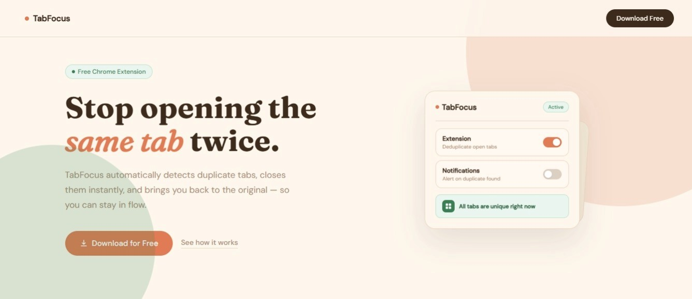

# TabFocus

**Stop opening the same tab twice. Stay focused automatically.**

TabFocus is a Chrome extension that detects duplicate tabs the moment they open, closes the extra one, and takes you back to the original — keeping your workspace clean without any effort.

---

## Why TabFocus?

When you're researching, coding, or working on assignments, it's easy to open the same page multiple times without realizing it.

The result:

* Cluttered tabs
* Lost context
* Reduced focus

TabFocus fixes this instantly — no manual cleanup, no interruptions.

---

## Demo

---

## Core Features

* **Instant duplicate detection**
  Detects identical URLs the moment a tab is opened

* **Automatic cleanup**
  Closes duplicate tabs before they become clutter

* **Smart focus switching**
  Returns you to the original tab seamlessly

* **Toggle control**
  Enable or disable anytime from the popup

* **Optional notifications**
  Get alerts when duplicates are closed (or keep it silent)

* **Lightweight performance**
  Runs in the background with minimal resource usage

---

## How It Works

1. You open a new tab
2. TabFocus checks all currently open tabs
3. If the URL already exists:

   * The new tab is closed
   * Focus shifts to the original tab
4. If not, the tab remains open as normal

---

## Installation

1. Clone or download this repository
2. Open Chrome and navigate to `chrome://extensions/`
3. Enable **Developer Mode** (top right)
4. Click **Load unpacked**
5. Select the project folder

TabFocus is now active.

---

## Usage

### Automatic Mode

* Browse normally
* Duplicate tabs are handled instantly in the background

### Popup Controls

Click the extension icon to access:

* **Extension Toggle** — turn TabFocus on/off
* **Notifications Toggle** — enable or disable alerts
* **Status Indicator** — shows whether TabFocus is active

---

## Technical Overview

### Built With

* Manifest V3
* Chrome Tabs API
* Chrome Storage API
* Chrome Notifications API

### Permissions

* `tabs` — detect and manage open tabs
* `storage` — persist user preferences
* `notifications` — send optional alerts
* `<all_urls>` — check tabs across all websites

---

## Limitations

* **Dynamic URLs (e.g. search pages)**
  Some websites generate unique URLs for similar content (like search results). These may not be detected as duplicates because the URLs differ technically.

---

## Roadmap

* [ ] URL normalization (ignore tracking/query parameters)
* [ ] Site whitelist (exclude specific domains)
* [ ] Duplicate tracking dashboard (usage insights)
* [ ] Manual scan for existing duplicates
* [ ] Bulk duplicate cleanup

---

## Project Structure

├── index.html

├── tabfocus-site
    ├── style.css

└── tabfocus
    ├── manifest.json ├── background.js ├── popup.html  ├── popup.js  └── assets/            

---

## Contributing

Contributions, issues, and feature requests are welcome.

If you find a bug or have an idea, feel free to open an issue or submit a pull request.

---

## License

MIT — free to use, modify, and distribute.

---

## About the Builder

**Built by** — [Ifechukwu Okuma](https://github.com/ifechukwuokuma)  
**Last updated** — April 10, 2026

